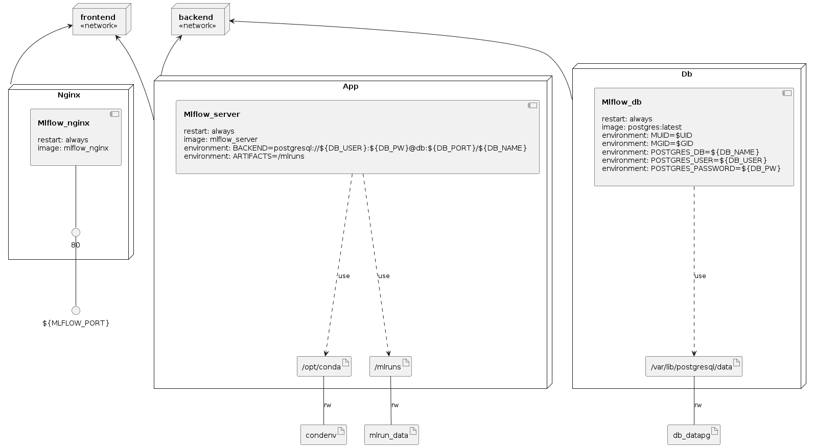

# docker_mlflow_db
A docker-compose setup to quickly provide MlFlow service with database backend
and a reverse proxy frontend which can optionally allow for basic authentication.

### Summary:
Originally based on [Guillaume Androz's 10-Jan-2020 Toward-Data-Science post,
"Deploy MLflow with docker compose"]
(https://towardsdatascience.com/deploy-mlflow-with-docker-compose-8059f16b6039),
with some changes to:
* replace AWS usage with local mapping for artifact store
* replace mysql with postgresql and other options.
* optionally apply htpasswd access control to mlflow website via nginx frontend

and overall allowing me to quickly clone to wherever I'm working whereas the
original was just a web article.

There are several docker-compose.yaml files in the compose_variations
subdirectory, any of which can be in lieu of the docker-compose.yaml in the
root directory to use the desired variation.  The docker-compose.yaml file is
a copy of compose_variations/docker-compose.mlflow_postgres_nginx.yaml.  Only
this docker-compose.yaml is necessarily fully up-to-date and tested, but
brief comparisons with the other files should make pretty clear what to update
if necessary.


Future To-dos:
* Add check for whether the env vars are set in shell (or .env file)
before kicking off container - this ia a mistake I regularly make myself.
* Add a boolean option to use an htpasswd file into the nginx container.
This password approach is not really secure, and note is only to limit
scope within an already-firewalled company, mainly to prevent inadvertent
changes by curious browsing colleagues.  Finding a better way to limit such
actions by user (especially deletes/changes) would be ideal.


### To run and connect to MLflow:
First set the following env vars in shell (these are listed in comments at
top of the docker-compose.yaml files); set as desired for your own system.
(Or you can put these into an .env file without the `export`s.)
These run mlflow with its backend store in postgresql and its artifact store
in a local docker volume.  The database is hidden on a backend network,
and the mlflow contents are viewable via website or REST API.
```bash
export MLFLOW_PORT=5000
export DB_NAME=mlflowdb
export DB_PORT=5432
export DB_USER=postgres
export DB_PW=<somepassword>        # (choose an actual pw)
```
A minor gotcha to note: this `<somepassword>` is expected to have no spaces
in it, not due to the database used but due to the way I pass it from this
variable.  Should fix this in future but meanwhile fyi.

*Warning:*
Also note there's a security issue in general with putting passwords in
environment variables, as one can interrogate the Linux process list and/or
the Docker inspect output and see it.  But typical use-case here is individual
or small-group usage contained inside a company's internal network behind a
firewall, so not at the top of my concern list.  Please beware for use-cases
beyond that.

Anyhow, start the containers with:
```bash
docker-compose up -d --build 
```
(`-d` for detached mode, `--build` to build the underlying containers if needed)
The first time will download/build the containers, but after that it will
start back up the existing containers and volumes, as can be seen via
```bash
docker-compose logs -f
```

We can verify it's all up and ready via:
```bash
> docker ps
CONTAINER ID   IMAGE             COMMAND                  CREATED          STATUS          PORTS                                   NAMES
dc99e6fc8d80   mlflow_nginx      "nginx -g 'daemon of…"   18 minutes ago   Up 18 minutes   0.0.0.0:5000->80/tcp, :::5000->80/tcp   mlflow_nginx
259ea89f1a9a   mlflow_server     "sh -c 'mlflow serve…"   19 minutes ago   Up 18 minutes   5001/tcp                                mlflow_server
07bbead3e910   postgres:latest   "docker-entrypoint.s…"   19 minutes ago   Up 19 minutes   5432/tcp                                mlflow_db
```

While it's up we can access the MLFlow website via `http://localhost:5001`.  If
this is running on a remote machine without firewalled access, you could access
via `http://remotehost:5001`, or if only access to remotehost is via ssh tunnel,
then this command running in a separate terminal:
```bash
ssh -CNL 5000:localhost:5000 <username>@<hostname>
```
will allow you to access the MLFlow website via `http://localhost:5001` locally.
If running on AWS, that line might look something like:
```bash
ssh -CNi "~/.ssh/my_awskey.pem" -L 5000:localhost:5000 ec2-user@12.34.56.78
```

Shut the docker-compose all down via `docker-compose down`, or if you want
the volumes (database and mlflow artifacts stores) entirely deleted too then:
```bash
> docker-compose down --volumes
Stopping mlflow_server ... done
Stopping mlflow_db     ... done
Removing mlflow_server ... done
Removing mlflow_db     ... done
Removing network docker_mlflow_db_mydefault
Removing volume docker_mlflow_db_db_datapg
Removing volume docker_mlflow_db_mlrun_data
```


### A few other functionalities to be aware of:

The makefile contains the following two macros which can be useful in testing
and development.  But to use them you'll need to have `mlflow` installed and
or a python virtual environment (recommended).  For the latter do:
```bash
python3 -m venv .venv
source .venv/bin/activate
pip install mlflow
```
and then just the `source .venv/bin/activate` is needed later to re-enter that
python environment (see standard python documentation about virtual environments).
Once you are in an environment where the `mlflow` executable is available, then
you can run (from your `docker_mlflow_db` root directory) if useful:

* `make mlflowquickcheck` just outputs the MLflow experiments list as a
  connectivity test
* `make mlflowpopulate` runs the small example project in mlflow-example
  to generate some example/test contents in your MLflow database.


### Some other relevant links:

https://github.com/ymym3412/mlflow-docker-compose  
https://medium.com/vantageai/keeping-your-ml-model-in-shape-with-kafka-airflow-and-mlflow-143d20024ba6  
https://docs.nginx.com/nginx/admin-guide/security-controls/configuring-http-basic-authentication/
https://www.digitalocean.com/community/tutorials/how-to-set-up-password-authentication-with-nginx-on-ubuntu-14-04
https://www.digitalocean.com/community/tutorials/how-to-set-up-http-authentication-with-nginx-on-ubuntu-12-10


### Infrastructure model

